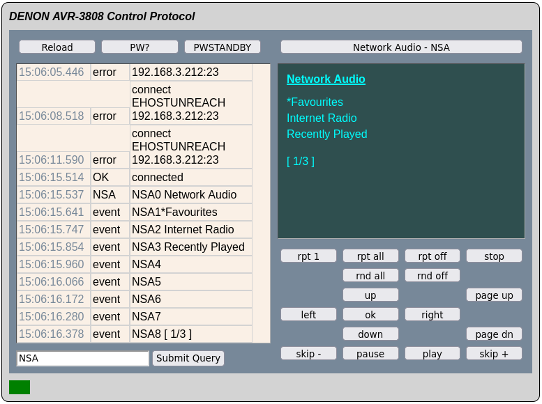

# AVR Control Protocol DenonStrator

_This tiny webapp works wih a Denon web-enabled AVR receiver such as the AVR-3808 / AVR-3808CI. It may work for others.
It is purely for geeky demonstration purposes of webstreams and websockets, it is not a end user remote control replacement!_

## Summary
Using Node JS and Express, the application offers a simple web interface to send and monitor simple
ASCII commands, these normally sent by external controllers to the receivers network port (PORT 23 - telnet).

It also uses Server-Sent Event (SSE) streaming to the browser, tested in both Chrome and Firefox.

The server can be run from the command line in a suitable operating system or it can be run as a docker image.

## Why?
This project is something I created while moaning about the poor Denon/DenonAVR integration offered in Home Assistant.

I was trying to get my subwoofer powered on, when the receiver was out of standby - and after using something
to check "PWON", and "PWSTANDBY" responses to the "PW?" command, decided a much simpler HA control solution was to try just
pinging the receiver - with the "Standby Mode Power Saving" setting enabled.

But a rabbit hole had only opened and I just had to look into it.

***

## Configuration
Change the ip address of the AVR and REST port in server.js (default: 8000) 

### Running in Docker
The included Dockerfile will install dependencies and run up an Alpine image.

### Running from the command line
1) Navigate to the root of this project in the command line.
1) Install Node (http://nodejs.org) and execute `npm install`. 
2) Run `node .` to launch the web server.

## Notes
- The full list of valid commands is available in the included protocol PDF from Denon. You may
find a closer one matching your receiver on Google.
- The reload button simply refreshes the page, a connection to the AVR is still magically maintained.
- Updated in real-time, the web interface also shows some user actions made with the receiver's front panel or remote control. Try the volume control!
- However, be very careful typing direct commands that set volume. With the wrong setting you can immediately damage your speakers _and_ scare the hell out of the cat, quite easily.
- Diagnostic output is also available on the process stdout stream.
- Usage is at your own risk.

## Acknowledgements
- Denon is just some Electronics company I have no connection with other than buying their things secondhand on eBay. This receiver is now over 15 years old.
  
  They made some good equipment but sadly their future as of 2024 looks very bleak.
  
